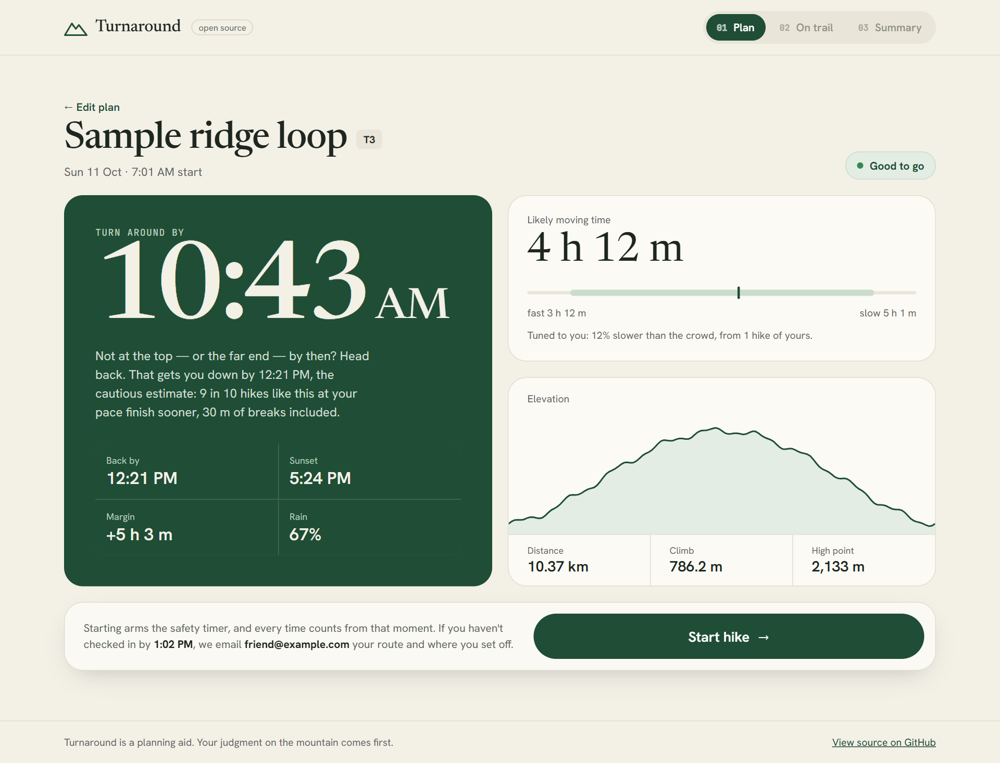
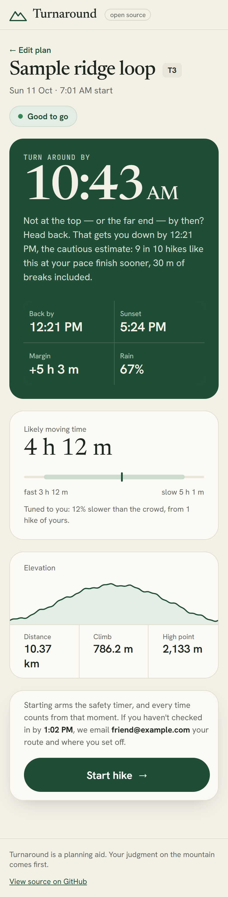
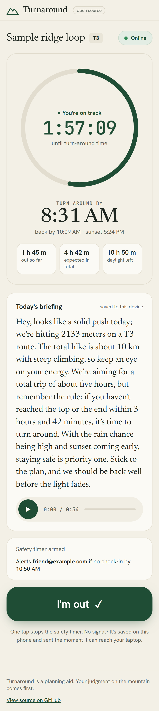
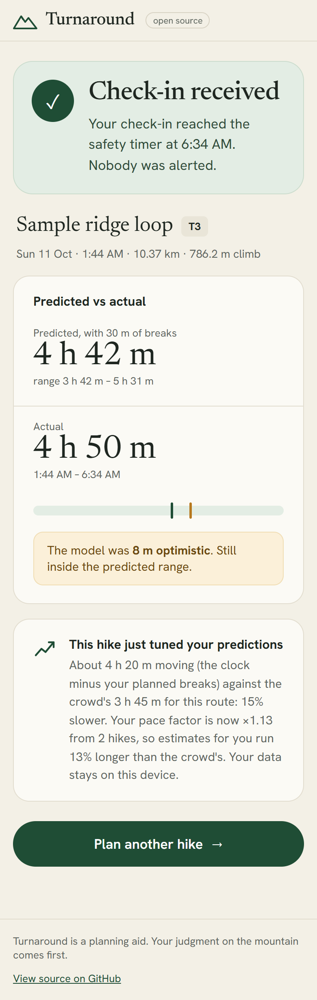
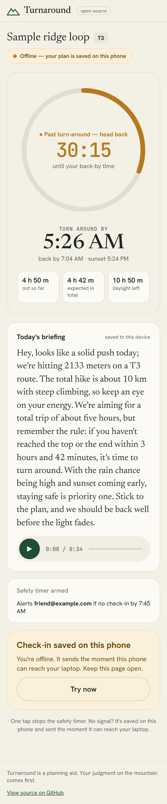
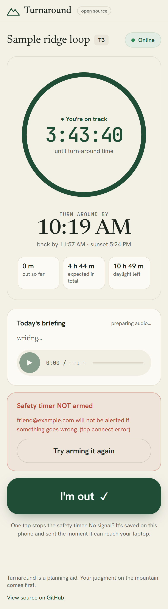
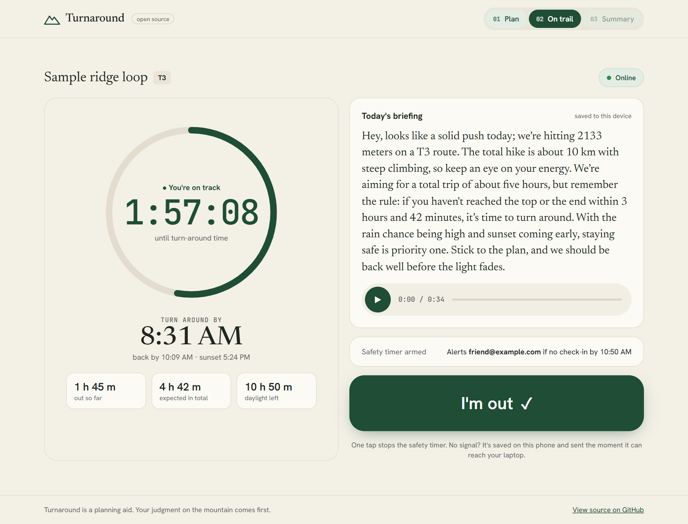
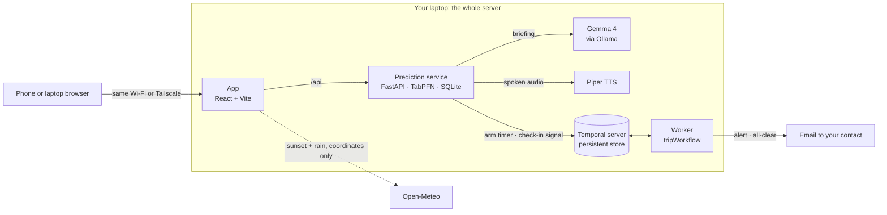

# Turnaround

An open-source hiking companion. It predicts how long your hike will take, tells you when to turn around, and quietly alerts someone you trust if you don't check in.

Built for the [Hacktoberfest Open-Source AI Challenge: Week 1](https://dev.to/challenges/hacktoberfest-week1-2026-10-05) on DEV — theme: **Touch Grass**.

## What it does

- **Predict** — TabPFN, in context on 7,186 real hikes from hikr.org, estimates your moving time as a range. A personal pace factor — your finished hikes against the crowd's estimate for the same routes — tunes it to you from your first check-in. Your planned breaks are added on top.
- **Turn around** — three moments per trip: *turn around by* (not at the top or the far end by then? head back), *back by* (the 90th percentile — 9 in 10 hikes like yours finish sooner), checked against sunset.
- **Brief** — Gemma 4, running on your own machine, turns the numbers into a plain-language briefing, spoken aloud with Piper and saved to your phone before you leave.
- **Watch** — a Temporal safety timer waits for your check-in. If you're still out well past your back-by time (the 95th percentile + breaks + 30 min), it emails your contact the plan, the route, and a map link to where you set off — even if the server restarts mid-trip. Check in late and they get an all-clear.

  
  
  

Captured from the running app with the synthetic <a href="data/sample-route.gpx">sample route</a>. The trail and summary shots fast-forward the trip clock to show a mid-hike and a finish.

More screens — no signal on the trail, and a timer that failed to arm

  
  
  

## Results

**Prediction** — 1,438 held-out hikr.org hikes the model never saw (trained on the other 5,748, seed 42). [Full table](prediction/results/eval_summary.md).

| | Naismith's rule | TabPFN v3.5 |
|---|---|---|
| Average error (MAE) | 44.1 min | **34.8 min** |
| RMSE | 69.1 min | **54.5 min** |
| Real times inside the predicted 90% band | — | **89.5%** |
| Hikers back before P90 — the back-by time | — | **90.4%** |

TabPFN v2, which the laptop serves by default because it's ~3x faster on CPU: MAE 35.5 · 87.9% · 89.7%.
On top of either, one finished hike that was 40% slower than predicted moves your next estimate up 12% —
shrunk on purpose while your history is thin ([the rules](prediction/rules.py), [their tests](prediction/tests/test_rules.py)).

**Safety timer** — five scenarios, each with evidence in [`docs/evidence/`](docs/evidence/).

| # | Scenario | What happened | Evidence |
|---|---|---|---|
| 1 | Check in on time | the timer closes; nobody is emailed | [log](docs/evidence/test1_on_time.txt) |
| 2 | Missed check-in while the mail server fails | retried; the alert went out on attempt 2 | [history](docs/evidence/test2_escalation_retry.json) · [email](docs/evidence/test2_alert_email.txt) |
| 3 | The worker is killed mid-trip | restarted 25 s later; the alert still fired exactly on the deadline | [history](docs/evidence/test3_worker_restart.json) · [email](docs/evidence/test3_alert_email.txt) |
| 4 | Drill: missed check-in, then a late check-in | alert on the deadline, then an all-clear to the contact | [history](docs/evidence/test4_drill_history.json) · [alert](docs/evidence/test4_drill_alert_email.txt) · [all-clear](docs/evidence/test4_drill_allclear_email.txt) |
| 5 | The Temporal **server** is killed mid-trip | the timer survived on disk; a check-in sent during the outage said so honestly and landed when re-sent | [log](docs/evidence/test5_temporal_server_restart.txt) |

Scenarios 1–3 ran before the alert moved from P90 to P95 + breaks + grace, and before alerts carried a location; 4–5 use the current flow.

## How it fits together

Everything runs on one laptop. The only outside call is an anonymous weather lookup (coordinates only) — and the alert email itself.

## Components

| Folder | Role | Stack |
|---|---|---|
| [`app/`](app/) | Plan / On-trail / Summary screens | React + Vite |
| [`agent/`](agent/) | Trip-planning agent and briefing (CLI) | Plain TypeScript + Gemma 4 + Piper |
| [`workflows/`](workflows/) | Safety timer, alert and all-clear emails | Temporal |
| [`prediction/`](prediction/) | Hike-time prediction service, trip rules, trip storage | Python + TabPFN + SQLite |
| [`data/`](data/) | Training data notes, sample routes | — |
| [`tests/`](tests/) | End-to-end smoke test for a running stack | Python |
| [`docs/`](docs/) | Design exports, safety-timer evidence, screenshots | — |

## Run it

Everything runs on one machine — no cloud account needed. First-time setup:

1. Node 20+ and Python 3.11 · `npm install` at the repo root
2. Python deps: `python -m venv .venv` then `.venv\Scripts\pip install -r prediction\requirements.txt`
3. Gemma 4: install [Ollama](https://ollama.com), then `ollama pull gemma4:e4b`
4. Piper + Temporal binaries: one-time fetch commands in [tools/README.md](tools/README.md)
5. Training data: download the dataset per [data/DATA_NOTES.md](data/DATA_NOTES.md), then `python prediction/build_dataset.py`
6. Optional: your own past hikes → `data/raw/gpx/`, then `.venv\Scripts\python.exe prediction\import_hikes.py --grade 3` (one run per grade) to seed your pace factor

Then one process per terminal:

| Terminal | Command |
|---|---|
| Temporal server | `tools\temporal\temporal.exe server start-dev --port 7233 --db-filename tools\temporal\turnaround.db` |
| Prediction service | `.venv\Scripts\python.exe -m uvicorn prediction.service:app --port 8000` |
| Safety-timer worker | `npm run worker -w @turnaround/workflows` |
| **The app (three screens)** | `npm run dev -w @turnaround/app` → open http://localhost:5173 |

`--db-filename` keeps running timers on disk, so they survive a restart of the Temporal server
itself (a Windows Update reboot included), not just of the worker.

Plan a hike in the app — no GPX handy? [`data/sample-route.gpx`](data/sample-route.gpx) is a
synthetic demo loop. Start arms the Temporal timer, the trail screen speaks the briefing, and
"I'm out" checks you in. The agent CLI (`npx tsx agent/src/cli.ts --gpx data/sample-route.gpx --grade 3`)
runs the same plan from a terminal; curl recipes live in [workflows/README.md](workflows/README.md).

## Tests

| What | Command |
|---|---|
| Trip rules: pace factor, turn-around split, timeline (stdlib only) | `python -m unittest discover -s prediction/tests -t .` |
| The agent's turn-around rule (node:test) | `npm test -w @turnaround/agent` |
| End-to-end against a running stack — use a scratch `TURNAROUND_DB` | `.venv\Scripts\python.exe tests\smoke_stack.py [--briefing]` |

CI runs the three typechecks, the app build and both unit suites on every push.

## Taking it on the trail

The laptop is the server, so your phone has to reach it from the trail:

- **Same Wi-Fi** works out of the box (Vite prints a `Network:` URL).
- **On mobile data**, put the laptop and phone on a private network — e.g.
  [Tailscale](https://tailscale.com) on both, then open `http://<laptop's Tailscale IP or name>:5173`
  on the phone. Nothing is exposed to the internet. Don't use a public tunnel: the app has no login.
- **Keep the laptop awake and online** for the whole hike — it runs the timer and sends the email.
  Plugged in: `powercfg /change standby-timeout-ac 0` (restore later with your usual value).
- **Plan while you have signal.** The briefing and its audio are saved to the phone when you plan.
  On the trail, keep the tab open: with no signal, "I'm out" is saved on the phone and sent the
  moment it can reach the laptop. (A page *reload* needs signal — there's no offline web cache.)

**Missed-check-in drill:** open the app as `http://…:5173/?drill=120` — the contact is emailed
120 s after Start (both emails are marked `[DRILL]`), and checking in afterwards sends the all-clear.

Starting fresh: stop everything, then delete `data/trips.db` **and** `tools/temporal/turnaround.db`
together — trip ids restart at 1, and a leftover timer would carry an old trip's id.

## Why open source

It runs on your own machine — no server, no subscription — so your location data never leaves it, and every model in the stack is swappable.

## License

[MIT](LICENSE) · training data: hikr.org tracks via Kaggle, CC0 ([notes](data/DATA_NOTES.md))
